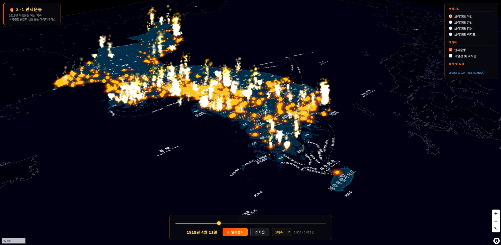
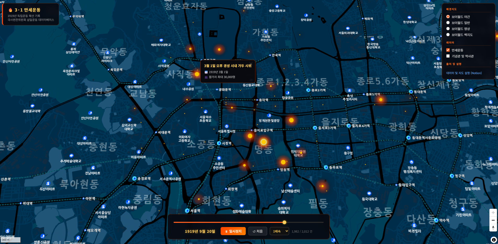
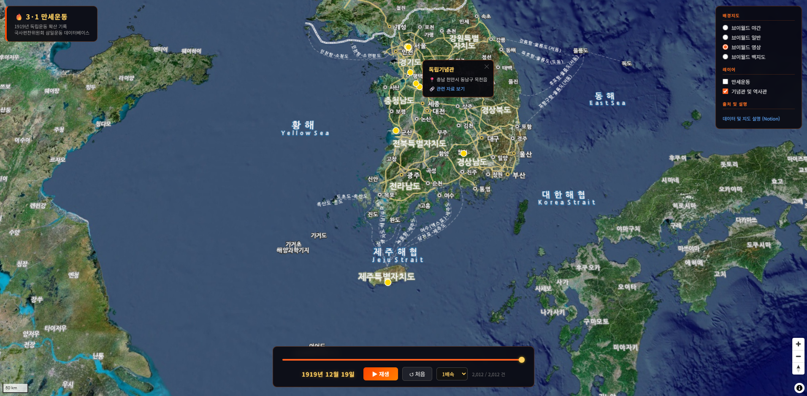

# 🔥 3·1 만세운동: 전국으로 퍼져나간 독립의 함성 

> **"들불처럼 전국에 퍼진 함성을 불꽃으로 표현하다."**

1919년 3월 1일, 전국 방방곡곡으로 번져나간 3·1 독립선언과 만세운동의 기록을 시간순으로 지도 시각화했습니다. 

**🚀 시연 페이지** | <a href="https://thlee33.github.io/3.1manse/" target="_blank" rel="noopener noreferrer">시연 페이지 (GitHub Pages)</a>   
**🎬 시연 동영상** | <a href="https://youtu.be/lLYi2hGtgIk" target="_blank" rel="noopener noreferrer">유튜브 영상 (YouTube)</a>   
**📝 기술 블로그** | <a href="https://unique-payment-110.notion.site/3-1-33e80db13da580d781a9f030417e0d69" target="_blank" rel="noopener noreferrer">기술 블로그 (Notion)</a>   

---

## 📽️ 프로젝트 개요

어둠이 깔린 한반도 지도 위로, 독립을 향한 열망이 불꽃이 되어 피어오릅니다. 단순한 위치 표시를 넘어, 일자별 데이터를 기반으로 만세운동의 전파 경로와 강도를 시각적인 '불꽃 파티클'로 구현하여 역동적인 역사의 현장을 재현했습니다.

*스크린샷 1: 3·1 만세운동 시각화 메인 화면*

---

## ✨ 핵심 기능

- **타임라인 애니메이션 엔진**: 1919년 3월부터의 만세운동 기록을 1배속부터 20배속까지 가변 속도로 재생할 수 있습니다.
- **불꽃 파티클 시스템 (Canvas API)**: 각 발발 지점의 규모와 시점에 따라 불꽃이 피어오르고 소멸하는 효과를 적용하여 '들불' 같은 확산세를 표현했습니다.
- **인터랙티브 히트맵**: MapLibre GL JS를 활용하여 만세운동의 밀집도를 히트맵으로 시각화했습니다.
- **역사 유적지 정보**: 기념관 및 역사관 위치와 상세 정보를 팝업으로 제공합니다.

---

## 🛠️ 기술 스택

- **Frontend**: HTML5, Vanilla JS, CSS3
- **Map Library**: MapLibre GL JS
- **Visualization**: HTML5 Canvas API (Particle System)
- **Data Source**: 국사편찬위원회 삼일운동 데이터베이스

*스크린샷 2: 확대해서 개별 포인트를 클릭하면 간략한 정보를 볼 수 있습니다.*

---

## 📊 데이터 출처
- **국사편찬위원회 삼일운동 데이터베이스**: 개방 데이터셋의 사건정보 csv, 세부장소 csv를 활용.

*스크린샷 3: 현재 방문할 수 있는 기념관 및 역사관 일부를 적용*

---
